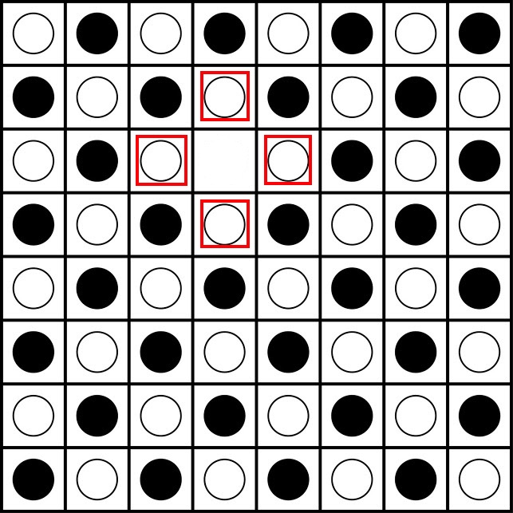
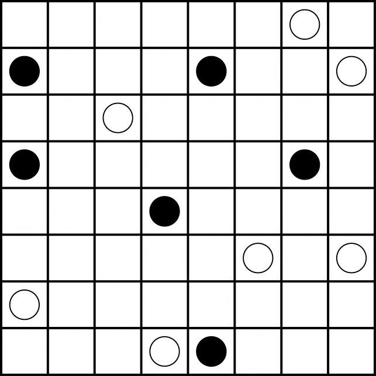

# AI-Final-Project
The python enviroment we used is Python 3.7. Higher version might not work.

## Introduction: Konane

Also known as Hawaiian checkers, [konane](https://en.wikipedia.org/wiki/Konane) is a strategy game played between two
players. Players alternate taking turns, capturing their opponent's pieces by jumping their own pieces over them (if 
you're familiar with checkers, there is a strong structural analogy to be made here). The first player to be unable to
capture any of their opponent's pieces loses.

The full rules can be read *[here](https://en.wikipedia.org/wiki/Konane#Rules_and_gameplay)* or
*[here](http://www.konanebrothers.com/How-to-Play.html)*. Here's my (rather terse) version, though:

1. Black typically starts. They take one of their pieces off of the board.

2. White then takes one of their pieces off of the board from a space _orthogonally_ adjacent to the piece that black
removed.

3. Each player then alternately moves their pieces in capturing moves. A capturing move has a stone move in an
orthogonal direction, hopping over an opponent's piece. Multiple captures may be made in a turn, as long as the stone
moves in the same direction and captures at least one piece.

4. The first player to be unable to capture a piece loses. :(