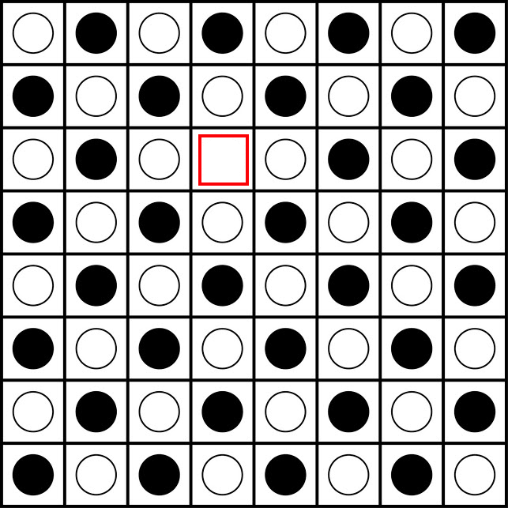

# AI-Final-Project
### By Zining(Kimi) Liu & Lixin(Leo) Li

In this project, we use tree graph visualization, which requires pygraphviz. For installing, you can read [here](https://pygraphviz.github.io/documentation/stable/install.html). 

## Introduction Monte Carlo Tree Search

### Background ###

[Monte Carlo Tree Search (MCTS)](https://en.wikipedia.org/wiki/Monte_Carlo_tree_search) is a widely-used algorithm for decision-making in artificial intelligence and game playing. 
Combining Monte Carlo simulation with tree search, MCTS efficiently explores large state spaces to find optimal solutions. 
It has been notably successful in games like Go and Chess, enabling groundbreaking achievements in AI systems. MCTS is ideal 
for problems with vast search spaces and expensive state evaluations, where traditional search methods fall short.

The game we choose is [konane](https://en.wikipedia.org/wiki/Konane) which is a strategy game played between two players.

## PyGraphviz ##
We use PyGraphviz to draw a tree graph in each Game for testing our algorithm Manually. This visualization shows the entire process of MCTS. Each `.gif` file
is one move in one game. For example, `MCTS Process 1.gif` means the first move. 

Because the time cost of MCTS itself and drawing each graph with PyGraphviz is quite high. Moreover, if you want to increase 
the number of simulations for each move in MCTS, the time it takes to run an entire game can even reach 5 hours or more as 
the number of simulations increases. For this reason, we have already run an entire game for you, which you can check in 
the process folder. All the `.gif` files comes from test3 in `test.py`, you can check all the parameters(ex. c value, simulation type ...) in test3.

You can read `Implementation` section to help you understand each graph in the .gif file.

If you want to try this feature yourself, you can read `test.py` section. 

## implementation ##
We learn the specific algorithm by watching this [video](https://www.youtube.com/watch?v=UXW2yZndl7U) on YouTube and playing this [project](https://vgarciasc.github.io/mcts-viz/),
and our general idea is basically the same as these. So, we highly recommend that you watch this video and try out the program.

### Explanation ###
Next we will explain our MCTS to you in detail：

#### Class Node ####
- `self.c_param` -
- `self.state` -
- `self.state` -
- `self.move` -
- `self.children` -
- `self.visits` -
- `self.value` -
- `self.player` -
- `add_child()` -
- `update()` -
- `ucb1()` -

#### class MonteCarloPlayer(Player) ####
- `board_to_graph_string()` -
- `add_graph_node()` -
- `add_graph_nodes_with_edges()` -
- `update_graph_nodes()` -
- `delete_graph_node()` -
- `update()` -
- `draw_graph()` - 
- `forward_propagation_update_graph()` - 
- `getMove()` - 
- `select()` -
- `expand()` -
- `run_simulation()` -
- `simulate()` -
- `random_simulation()` -
- `alphabeta_simulation()` -
- `alphabeta_getmove()` -
- `alpha_beta_max_value()` -
- `alpha_beta_min_value()` -

## Testing MCTS ###
We evaluate our MCTS algorithm by just examining the PyGraphviz Graph manually. Writing tests for MCTS is challenging because 
all variables are determined by the outcomes of simulations, and it is impossible to predict the results of random simulations 
beforehand. Similarly, if we use alpha-beta simulations, we would need to anticipate all outcomes of the alpha-beta algorithm 
first, which is undoubtedly a difficult and time-consuming task. All random and alpha-beta simulations have already been 
implemented and thoroughly tested in Homework 4. As a result, utilizing PyGraphviz to draw graphs and debug step by step 
has become a relatively simple and highly convenient approach for us.

### test.py ###

**gm = self.makeGame**

In test.py, you can use `gm = self.makeGame` to create one game. Here is all the parameters:

-`size`(int) -- 

`test1`
This test is used for run a single game

`test2`
This test is used for exploring `c` and write the result into `history.json`. 

`test3`
This test is used for Drawing graph. We just the number of simulations in each move to 20, because this is just used for
testing the algorthm Manually

